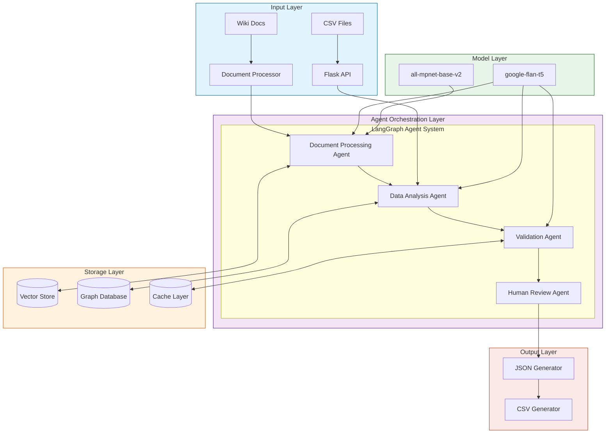

# Data Modeling Copilot (DMC)

A collaborative AI system that assists in data modeling by leveraging Wiki documentation and LangGraph-powered agents.

## System Architecture



## Project Overview

Data Modeling Copilot (DMC) is an intelligent assistant that streamlines the data modeling process by combining Wiki documentation analysis with automated column naming and data type suggestions, while maintaining human oversight for critical decisions.

### Key Features
- Wiki-based knowledge extraction
- Automated column name standardization
- Data type inference and validation
- Human-in-the-loop verification
- GraphRAG-powered context understanding
- REST API interface

## Technical Stack

### Core Components
- **API Framework**: Flask
- **LLM**: google-flan-t5
- **Embeddings**: all-mpnet-base-v2
- **Graph Framework**: LangGraph
- **Vector Store**: FAISS
- **Graph Database**: Neo4j/NetworkX

### Agent System
1. **Document Processing Agent**
   - Wiki indexing
   - Document embedding
   - Knowledge graph construction

2. **Data Analysis Agent**
   - CSV parsing
   - Column analysis
   - Transformation proposals

3. **Validation Agent**
   - Rule compliance checking
   - Data type validation
   - Naming convention enforcement

4. **Human Review Agent**
   - Review interface management
   - Feedback collection
   - Knowledge base updates

## Setup and Installation

### Prerequisites
```bash
python 3.8+
virtualenv
git
```

### Installation
```bash
# Clone repository
git clone https://github.com/yourusername/data-modeling-copilot.git
cd data-modeling-copilot

# Create virtual environment
python -m venv venv
source venv/bin/activate  # Unix
.\venv\Scripts\activate   # Windows

# Install dependencies
pip install -r requirements.txt
```

### Configuration
Create `config.yml`:
```yaml
app:
  name: "Data Modeling Copilot"
  version: "1.0.0"

models:
  llm: "google-flan-t5"
  embeddings: "all-mpnet-base-v2"

api:
  host: "0.0.0.0"
  port: 5000

storage:
  vector_store_path: "./storage/vectors"
  graph_db_path: "./storage/graph"
  cache_path: "./storage/cache"
```

## API Usage

### Transform Endpoint
```http
POST /api/v1/transform
Content-Type: application/json

{
  "csv_data": "base64_encoded_csv",
  "options": {
    "require_review": true,
    "confidence_threshold": 0.85
  }
}
```

### Response Format
```json
{
  "status": "success",
  "data": {
    "transformed_columns": [
      {
        "original_name": "military_sep",
        "suggested_name": "MIL_SEP_DT",
        "data_type": "DATE",
        "nullable": false,
        "confidence": 0.92
      }
    ],
    "requires_review": [],
    "metadata": {
      "processed_at": "2024-11-09T10:00:00Z",
      "model_version": "1.0.0"
    }
  }
}
```

## GraphRAG Implementation

### Knowledge Graph Structure
- **Nodes**
  - Column definitions
  - Data type specifications
  - Business rules
  - Documentation references

- **Edges**
  - Transformation rules
  - Dependencies
  - Historical mappings

### Query Processing
1. Input analysis
2. Context retrieval
3. Graph traversal
4. Response generation

## Security

### Authentication
- API key authentication
- Role-based access control
- Audit logging

### Data Protection
- Input validation
- Output sanitization
- Secure storage

## Maintenance

### Regular Tasks
- Wiki synchronization
- Graph updates
- Model retraining
- Performance monitoring

### Monitoring
- API health checks
- Model performance metrics
- Resource utilization
- Error tracking

## Contributing

Please refer to [CONTRIBUTING.md](CONTRIBUTING.md) for guidelines.

## License

MIT License - see [LICENSE.md](LICENSE.md)
