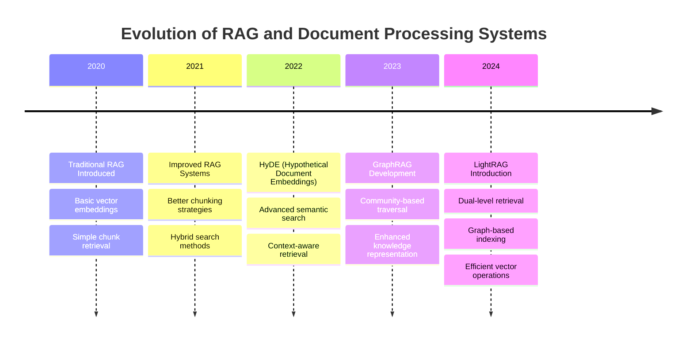
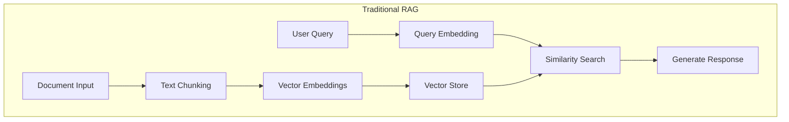
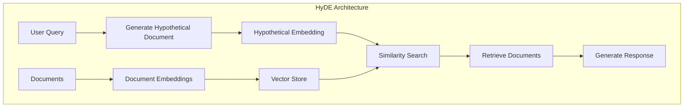
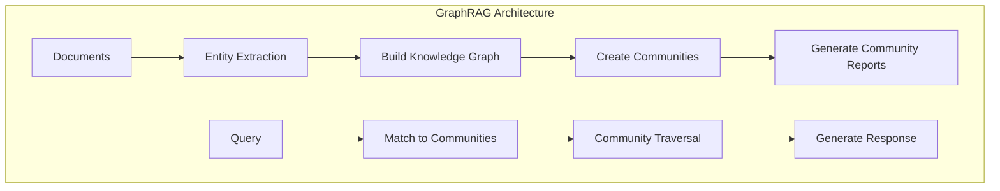
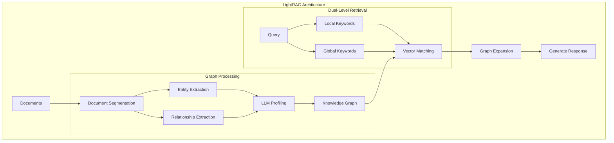
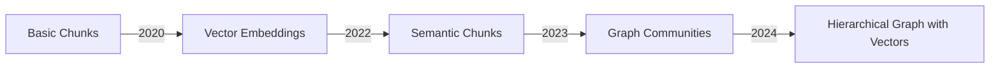
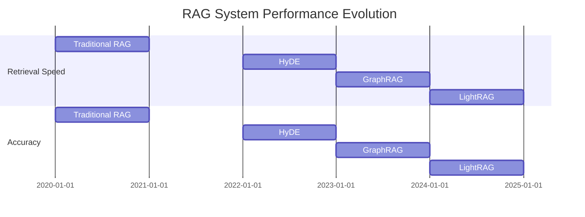
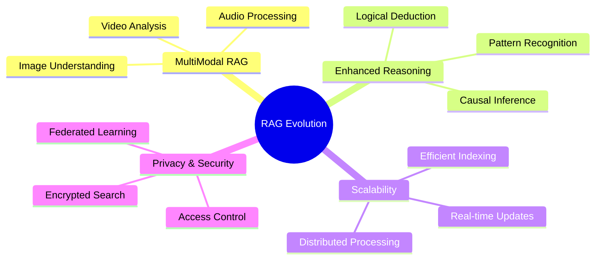

# Evolution of LLMs with Internal Documentation

This repository tracks the development and evolution of Large Language Models (LLMs) specifically in the context of handling internal documentation and knowledge bases.

## Timeline of Major Developments

## Architectural Evolution

### 1. Traditional RAG (2020)
Basic architecture of early Retrieval Augmented Generation:

### 2. HyDE - Hypothetical Document Embeddings (2022)
Enhanced retrieval through hypothetical document generation:

### 3. GraphRAG (2023)
Introduction of graph-based knowledge representation:

### 4. LightRAG (2024)
Latest development with dual-level retrieval and efficient graph operations:

## Key Improvements Over Time

### Retrieval Mechanisms
- 2020: Basic vector similarity
- 2022: Hypothetical document matching
- 2023: Community-based traversal
- 2024: Dual-level retrieval with graph structure

### Knowledge Organization

### Performance Metrics

## Future Directions

## References

1. RAG (2020): "Retrieval-Augmented Generation for Knowledge-Intensive NLP Tasks"
2. HyDE (2022): "Precise Zero-Shot Dense Retrieval without Relevance Labels"
3. GraphRAG (2023): "Graph-based Document Analysis Framework"
4. LightRAG (2024): "LightRAG: Simple and Fast Retrieval-Augmented Generation"

## Implementation Guidelines

For implementing these systems in your own projects, consider:
- Document preprocessing requirements
- Vector database selection
- Graph database requirements
- Computational resources needed
- Scaling considerations

