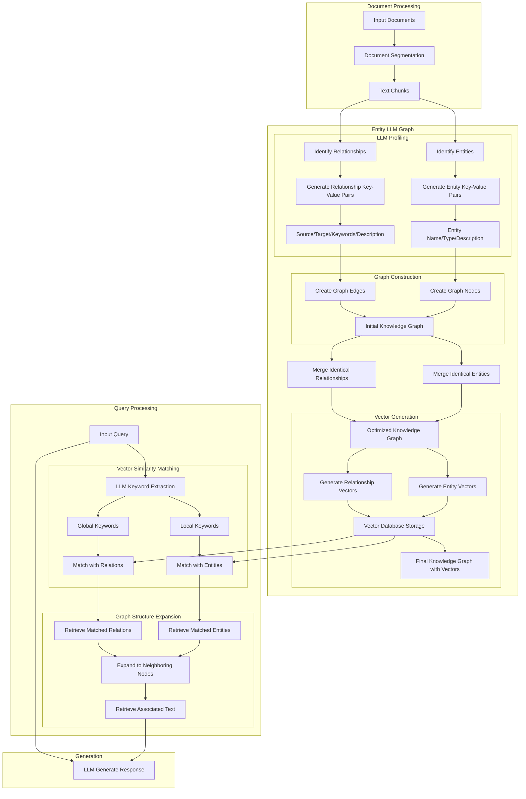

```mermaid
flowchart TD
    subgraph "Document Processing"
        InputDocs[Input Documents] --> DocSeg[Document Segmentation]
        DocSeg --> TextChunks[Text Chunks]
    end
    
    subgraph "Entity LLM Graph"
        TextChunks --> IDEntities[Identify Entities]
        TextChunks --> IDRelations[Identify Relationships]
        
        subgraph "LLM Profiling"
            IDEntities --> GenEntityKV[Generate Entity Key-Value Pairs]
            IDRelations --> GenRelationKV[Generate Relationship Key-Value Pairs]
            GenEntityKV --> EntityProfiling[Entity Name/Type/Description]
            GenRelationKV --> RelationProfiling[Source/Target/Keywords/Description]
        end
        
        subgraph "Graph Construction"
            EntityProfiling --> CreateNodes[Create Graph Nodes]
            RelationProfiling --> CreateEdges[Create Graph Edges]
            CreateNodes --> InitialKG[Initial Knowledge Graph]
            CreateEdges --> InitialKG
        end
        
        InitialKG --> MergeEntities[Merge Identical Entities]
        InitialKG --> MergeRelations[Merge Identical Relationships]
        MergeEntities --> OptimizedKG[Optimized Knowledge Graph]
        MergeRelations --> OptimizedKG
        
        subgraph "Vector Generation"
            OptimizedKG --> GenEntityVec[Generate Entity Vectors]
            OptimizedKG --> GenRelationVec[Generate Relationship Vectors]
            GenEntityVec --> VectorDB[Vector Database Storage]
            GenRelationVec --> VectorDB
            VectorDB --> FinalKG[Final Knowledge Graph with Vectors]
        end
    end

    subgraph "Query Processing"
        InputQuery[Input Query] --> LLMExtract[LLM Keyword Extraction]
        
        subgraph "Vector Similarity Matching"
            LLMExtract --> LocalKW[Local Keywords]
            LLMExtract --> GlobalKW[Global Keywords]
            LocalKW --> MatchEntities[Match with Entities]
            GlobalKW --> MatchRelations[Match with Relations]
            VectorDB --> MatchEntities
            VectorDB --> MatchRelations
        end
        
        subgraph "Graph Structure Expansion"
            MatchEntities --> RetrieveEntities[Retrieve Matched Entities]
            MatchRelations --> RetrieveRelations[Retrieve Matched Relations]
            RetrieveEntities --> ExpandNodes[Expand to Neighboring Nodes]
            RetrieveRelations --> ExpandNodes
            ExpandNodes --> RetrieveText[Retrieve Associated Text]
        end
    end

    subgraph "Generation"
        RetrieveText --> LLMGenerate[LLM Generate Response]
        InputQuery --> LLMGenerate
    end
```