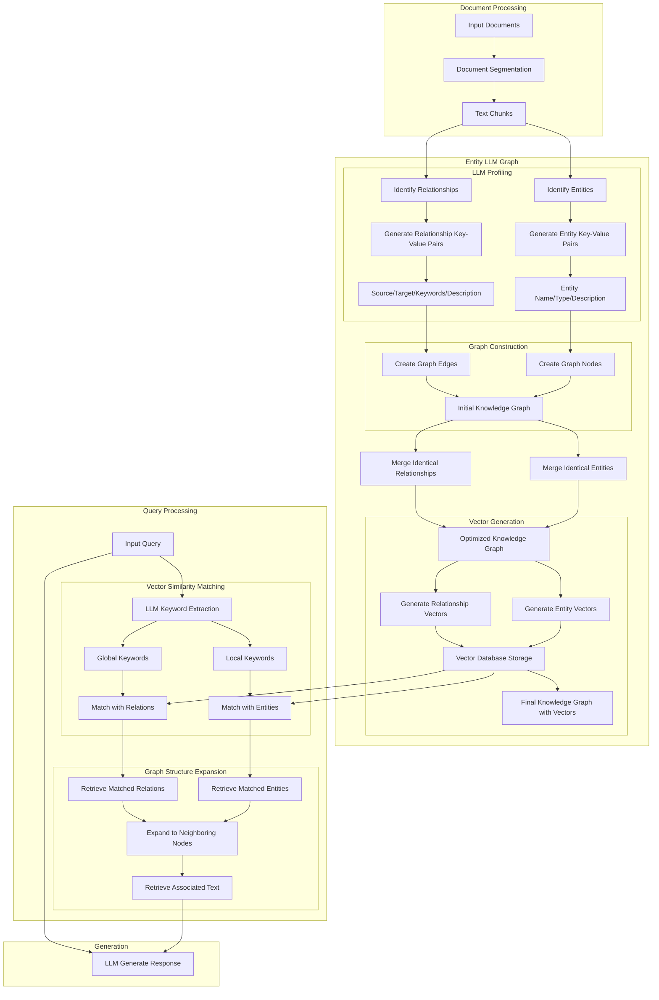

# LightRAG Process for Data Modeling Copilot



Here's a detailed explanation of how Data Modeling Copilot could work with LightRAG and AI Agents using LangGraph:

# LightRAG Data Modeling Architecture

## Core Components Overview

### 1. Document Processing
The system begins with raw input documents that get processed through two key steps:
- **Input Documents**: Source materials containing domain knowledge, requirements, and specifications
- **Document Segmentation**: Breaking down large documents into manageable chunks
- **Text Chunks**: Smaller, processable segments that maintain contextual meaning

### 2. Entity LLM Graph
This core section represents the knowledge extraction and structuring phase:

#### LLM Profiling
- **Entity Identification**: Recognizes and extracts key entities from text chunks
- **Relationship Identification**: Identifies connections between entities
- **Key-Value Pair Generation**: 
  - For Entities: Creates structured representations with name, type, and description
  - For Relationships: Defines source, target, keywords, and descriptive content

#### Graph Construction
- **Node Creation**: Converts entity profiles into graph nodes
- **Edge Creation**: Establishes connections based on identified relationships
- **Initial Knowledge Graph**: First version of the connected data structure
- **Deduplication**: 
  - Merges identical entities
  - Combines duplicate relationships
  - Results in an optimized knowledge graph

#### Vector Generation
- Converts both entities and relationships into vector representations
- Stores vectors in a vector database
- Creates the final knowledge graph enhanced with vector representations

## Data Modeling Copilot Integration

Here's how Data Modeling Copilot could leverage this architecture:

### 1. Domain-Specific Knowledge Enhancement
- The LightRAG system can be trained on:
  - Database design patterns
  - Industry-standard data models
  - Best practices for specific domains
  - Common pitfalls and solutions

### 2. AI Agents with LangGraph Implementation

LangGraph could be used to create a network of specialized agents:

#### Schema Analysis Agent
```python
class SchemaAnalysisAgent:
    def analyze_requirements(self, text_chunks):
        # Use LightRAG to extract entities and relationships
        # Map these to potential database schema elements
        return schema_suggestions

    def validate_design(self, proposed_schema):
        # Check against best practices stored in knowledge graph
        # Return validation results and suggestions
```

#### Optimization Agent
```python
class OptimizationAgent:
    def suggest_improvements(self, current_schema):
        # Query similar patterns in knowledge graph
        # Identify potential performance optimizations
        return optimization_recommendations

    def analyze_query_patterns(self, sample_queries):
        # Use LightRAG to understand query requirements
        # Suggest index strategies and schema adjustments
```

#### Integration Orchestrator
```python
class ModelingOrchestrator:
    def __init__(self):
        self.schema_agent = SchemaAnalysisAgent()
        self.optimization_agent = OptimizationAgent()
        self.graph = LangGraph()

    def process_modeling_request(self, requirements):
        # Coordinate agent activities
        initial_analysis = self.schema_agent.analyze_requirements(requirements)
        optimizations = self.optimization_agent.suggest_improvements(initial_analysis)
        return self.generate_final_model(initial_analysis, optimizations)
```

### 3. Workflow Integration

The complete workflow would look like this:

1. **Input Processing**
   - Requirements documents are processed through LightRAG's document processing pipeline
   - Text is chunked and analyzed for data modeling contexts

2. **Knowledge Extraction**
   - Domain-specific entities are identified (tables, columns, relationships)
   - Best practices and patterns are matched from the knowledge graph

3. **Agent Collaboration**
   - Schema Analysis Agent proposes initial data structures
   - Optimization Agent suggests improvements
   - Agents communicate through LangGraph framework

4. **Iterative Refinement**
   - Generated models are validated against best practices
   - Feedback is incorporated into the knowledge graph
   - Models are optimized based on performance requirements

### 4. Continuous Learning

The system can improve over time by:
- Recording successful modeling patterns
- Learning from user feedback
- Updating the knowledge graph with new best practices
- Expanding domain-specific understanding

This integration creates a powerful data modeling assistant that combines:
- LightRAG's sophisticated knowledge processing
- LangGraph's agent coordination capabilities
- Domain-specific expertise in data modeling
- Continuous learning and improvement mechanisms

The result is a system that can not only suggest data models but also explain its reasoning, adapt to specific requirements, and improve over time through usage.